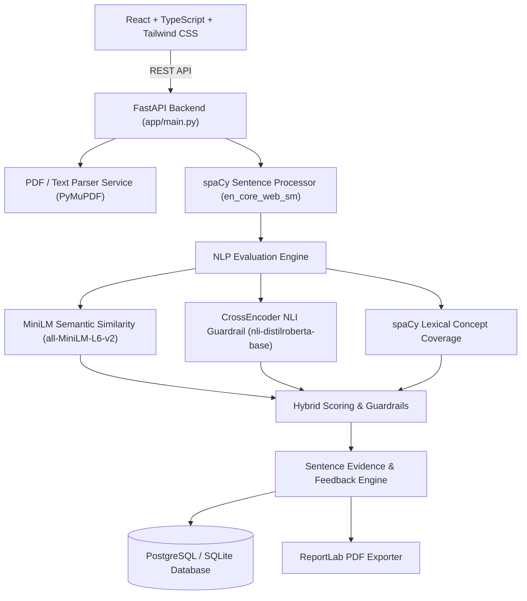

# EvalUI — Offline-First Explainable AI Descriptive Answer Evaluation Platform

**EvalUI** is an offline-first, lightweight, explainable descriptive-answer evaluation system designed for college and school assessments. It combines **semantic similarity**, **NLI contradiction detection**, **lexical concept coverage**, and **sentence-level evidence extraction** to grade descriptive answers against instructor-created rubrics without relying on cloud LLM APIs or susceptible keyword-matching algorithms.

---

## 1. Problem Statement & Core Vision

> **Problem**: Teachers spend significant time manually grading descriptive answers. Existing automated tools rely purely on keyword presence or cosine similarity, which mistakenly award high marks when students repeat keywords while providing factually incorrect or negated statements (e.g. *"TCP is NOT connection-oriented"*).

**EvalUI Solution**:
- **Offline-First & Lightweight**: Runs entirely on local CPU (8 GB RAM target) with zero cloud LLM APIs (OpenAI, Gemini, Claude).
- **Contradiction Guardrail**: NLI model flags negated statements (`contradiction_probability > 0.60`) and enforces 0 marks.
- **Evidence-Based Grounding**: Extracts exact sentence proofs and highlights student text in Green (Entailed), Yellow (Partial), or Red (Contradicted).
- **Keyword Stuffing Detection**: Flags submissions with high keyword density but low semantic/contextual support.
- **Teacher Human-in-the-Loop**: Instructors can override AI scores with justification while preserving original AI evaluations.

---

## 2. System Architecture



---

## 3. Technology Stack

- **Frontend**: React, TypeScript, Vite, Tailwind CSS, Lucide React, Axios.
- **Backend**: Python 3.10+, FastAPI, Pydantic, Uvicorn, SQLAlchemy, PyMuPDF, ReportLab.
- **NLP Models**:
  - `sentence-transformers/all-MiniLM-L6-v2` (Semantic Similarity)
  - `cross-encoder/nli-distilroberta-base` (Entailment & Contradiction Detection)
  - `spacy / en_core_web_sm` (Linguistic Sentence Segmentation & Tokenization)
- **Database**: PostgreSQL (Docker) / SQLite (Zero-config local development).

---

## 4. Discovered NLI Label Mapping

Model: `cross-encoder/nli-distilroberta-base`
- Index `0`: `contradiction`
- Index `1`: `entailment`
- Index `2`: `neutral`

Empirically verified during model configuration inspection.

---

## 5. Scoring & Guardrail Formula

### Hybrid Score Calculation:
$$\text{raw\_score} = 0.45 \cdot \text{semantic\_score} + 0.45 \cdot \text{entailment\_score} + 0.10 \cdot \text{lexical\_score}$$

### Contradiction Guardrail:
$$\text{If } P(\text{contradiction}) > 0.60 \implies \text{status} = \text{CONTRADICTED}, \, \text{awarded\_marks} = 0.0$$

### Discretization & Partial Credit:
Normalized raw scores are discretized into clean mark bands ($0.0$, $0.25$, $0.50$, $0.75$, $1.0$) mapped to criterion `max_marks`.

---

## 6. Demo Test Cases (TCP Three-Way Handshake)

EvalUI includes pre-configured demo test cases:
1. **Case A — Correct**: High/full credit (4.0/4.0), green evidence highlighting.
2. **Case B — Contradiction**: Direct negation detected ($P(\text{contradiction}) = 0.9944$), red evidence, zero marks awarded.
3. **Case C — Partial**: Covers initial steps, receives partial credit (3.0/4.0), identifies missing ACK concept.
4. **Case D — Paraphrased**: Paraphrased conceptual statement recognized via MiniLM embeddings.
5. **Case E — Off Topic**: Unrelated answer ("Cricket") receives 0.0/4.0 with no false positive.
6. **Case F — Keyword Stuffing**: Keyword list without grammar triggers "Possible Keyword Stuffing" warning.

---

## 7. Running the Project Locally

### Backend Setup:
```bash
cd evalui/backend
pip install -r requirements.txt
python -m spacy download en_core_web_sm

# Run stand-alone NLP engine verification tests (Cases A-F):
python test_engine.py

# Run pytest unit test suite:
python -m pytest tests/

# Start FastAPI Uvicorn dev server:
uvicorn app.main:app --reload --port 8000
```

### Frontend Setup:
```bash
cd evalui/frontend
npm install
npm run build
npm run dev
```
Open [http://localhost:3000](http://localhost:3000) in your browser.

---

## 8. Docker Deployment

```bash
cd evalui
docker-compose up --build
```
This spins up PostgreSQL on port `5432` and FastAPI on port `8000`.

---

## 9. API Documentation

Interactive OpenAPI documentation is available at `http://localhost:8000/docs`:
- `GET /api/v1/health`
- `POST /api/v1/assignments`
- `GET /api/v1/assignments/{id}`
- `POST /api/v1/submissions/text`
- `POST /api/v1/submissions/pdf`
- `POST /api/v1/evaluate`
- `GET /api/v1/evaluations/{id}`
- `POST /api/v1/evaluations/{id}/override`
- `GET /api/v1/evaluations/{id}/report`

---

## 10. Engineering Metrics & Benchmarks

- **Model Load Time**: ~1.5s - 3.0s (Lazy singleton initialization)
- **Evaluation Latency**: ~0.04s - 0.16s per submission on CPU
- **Memory Footprint**: ~450 MB RAM on CPU
